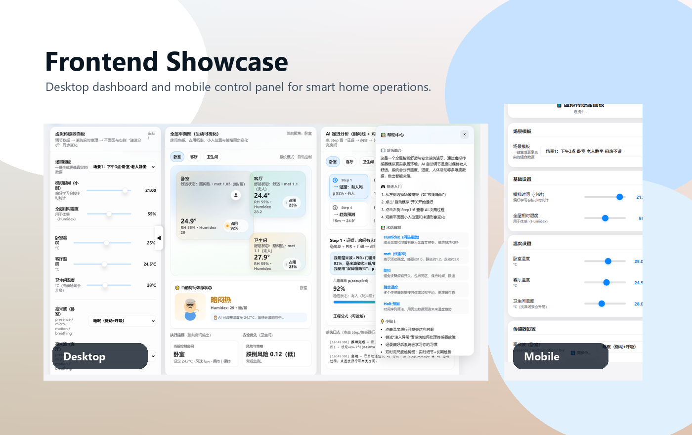
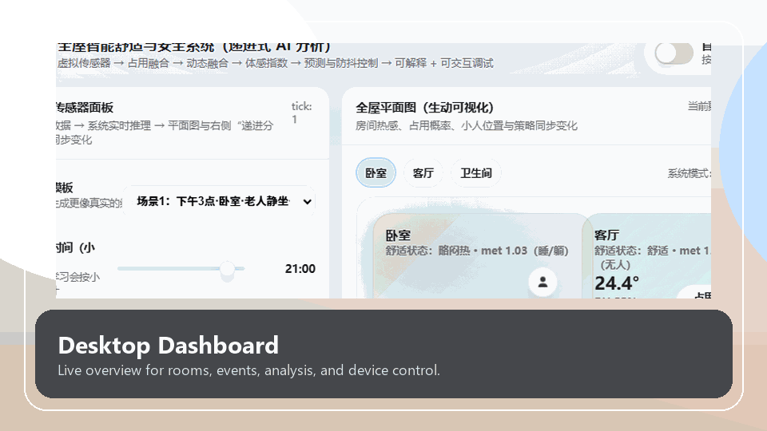
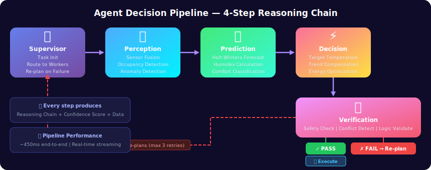

# Smart Home Multi-Agent System

> AI-powered elderly care smart home platform using Multi-Agent collaboration to replace rigid rule engines.

[](https://python.org)
[](https://fastapi.tiangolo.com)
[](https://langchain-ai.github.io/langgraph/)
[](https://www.home-assistant.io/)
[](LICENSE)

<p align="center">
  <b>English</b> | <a href="#cn">CN</a>
</p>

## Overview

This project is a smart home system for elderly care scenarios. Instead of relying on fixed if-then rules, it uses a Multi-Agent pipeline to perceive room status, predict short-term environmental changes, generate comfort and safety decisions, and verify whether the action is safe before execution.

Core capabilities:

- Multi-Agent orchestration with Supervisor + Worker agents
- Comfort control based on Humidex and activity-aware thresholds
- Safety monitoring with multi-sensor fusion and conflict detection
- Hybrid prediction with Holt-Winters, Holt, and Newton Cooling
- Home Assistant integration through REST and WebSocket
- Web dashboard + mobile control page + Docker deployment

## Frontend Showcase

The repository includes two frontend entry pages:

- `gai.html`: desktop dashboard for system monitoring, analysis, and control
- `mobile-control.html`: lightweight mobile control panel

### Hero Preview



### Demo GIF

<p align="center">
  
</p>

These assets are generated from the real frontend pages in the repository, so the README preview stays aligned with the current UI.

## Key Differentiators

| Feature | Traditional Smart Home | This System |
|---------|------------------------|-------------|
| Decision Engine | Fixed rules | Multi-Agent collaborative reasoning |
| Comfort Control | Manual temperature setting | AI-based comfort calculation |
| Safety Monitoring | Single-sensor alarm | Multi-sensor fusion and verification |
| Prediction | None | 30-minute trend prediction |
| Explainability | Limited | Full reasoning chain |
| Elderly Care | Generic | Elderly-adapted comfort model |

## Architecture

<p align="center">
  
</p>

### Agent Pipeline Flow

<p align="center">
  
</p>

## Quick Start

### Prerequisites

- Python 3.10+
- Node.js 18+

### 1. Clone the Repository

```bash
git clone https://github.com/telawang91-dotcom/smart-home-multi-agent.git
cd smart-home-multi-agent
```

### 2. Configure the Python Agent Engine

```bash
cd agent_engine
cp .env.example .env
pip install -r requirements.txt
cd ..
```

Edit `agent_engine/.env` as needed before running the system.

### 3. Install Node Dependency

```bash
npm install
```

### 4. Start Services

```bash
# Terminal 1
cd agent_engine
python main.py
```

```bash
# Terminal 2
node sync-server.js
```

### 5. Open the Frontend

- Main dashboard: `http://localhost:8080`
- Swagger API docs: `http://localhost:8081/docs`
- Mobile page: open `mobile-control.html` or serve it from the same static host

## Frontend Entry Points

| File | Purpose |
|------|---------|
| `gai.html` | Main dashboard UI |
| `mobile-control.html` | Mobile-first control interface |
| `sync-server.js` | Node.js gateway and WebSocket relay |

## Connect to Home Assistant

Switch from simulation mode to real devices in three steps:

```bash
# agent_engine/.env
HA_ENABLED=true
HA_URL=http://your-ha-ip:8123
HA_TOKEN=your-long-lived-access-token

HA_ENTITY_BEDROOM_TEMP=sensor.bedroom_temperature
HA_ENTITY_BEDROOM_HUMIDITY=sensor.bedroom_humidity
HA_ENTITY_BEDROOM_PRESENCE=binary_sensor.bedroom_fp2_presence
HA_ENTITY_BEDROOM_AC=climate.bedroom_ac
```

Then restart the agent engine:

```bash
cd agent_engine
python main.py
```

See [`agent_engine/.env.example`](agent_engine/.env.example) for the full configuration template.

## Scientific Models

### Humidex

The system uses a dew-point-based Humidex model for body-felt temperature estimation.

```text
Td = 243.04 * gamma / (17.625 - gamma)
e  = 6.11 * exp(5417.753 * (1/273.16 - 1/(Td+273.15)))
Hx = T + 5/9 * (e - 10)
```

### Hybrid Prediction Engine

| Data Available | Model |
|----------------|-------|
| >= 24 points | Holt-Winters |
| >= 3 points | Holt |
| < 3 points | Newton Cooling Law |
| Mixed | Weighted hybrid |

### Comfort Classification

- Metabolic-rate correction for sleep, sitting, and walking
- Elderly-adapted tighter comfort thresholds

## Project Structure

```text
smart-home-multi-agent/
|-- gai.html
|-- mobile-control.html
|-- sync-server.js
|-- Dockerfile
|-- docker-compose.yml
|-- docker-start.sh
|-- package.json
|-- docs/
|   |-- architecture.svg
|   |-- agent-pipeline.svg
|   |-- showcase/
|   |   |-- showcase-hero.png
|   |   `-- showcase-demo.gif
|   `-- screenshots/
|       |-- frontend-desktop.png
|       `-- frontend-mobile.png
`-- agent_engine/
    |-- main.py
    |-- config.py
    |-- requirements.txt
    |-- .env.example
    |-- agents/
    |-- api/
    |-- models/
    `-- tools/
```

## API Overview

| Category | Endpoint | Method | Description |
|----------|----------|--------|-------------|
| Agent | `/api/analyze` | POST | Run full Agent pipeline |
| Agent | `/api/analyze/stream` | POST | SSE streaming pipeline |
| Agent | `/api/ws/analyze` | WS | WebSocket real-time analysis |
| Agent | `/api/health` | GET | Health check |
| Home Assistant | `/api/ha/status` | GET | HA connection status |
| Home Assistant | `/api/ha/sensors` | GET | All room sensor data |
| Home Assistant | `/api/ha/control` | POST | Device control |
| Home Assistant | `/api/ha/analyze-live` | POST | Live sensor to decision flow |
| Scenario | `/api/scenarios` | GET | List preset scenarios |
| Scenario | `/api/scenarios/{id}` | POST | Run scenario |
| Data | `/api/data/decisions` | GET | Decision history |
| Scheduler | `/api/scheduler/status` | GET | Scheduler status |
| Notifications | `/api/notifications` | GET | Notification history |
| Notifications | `/api/notifications/test` | POST | Test notification |

Full interactive docs: `http://localhost:8081/docs`

## Demo Scenarios

Use these endpoints to demonstrate the system behavior:

```bash
curl -X POST http://localhost:8081/api/scenarios/sensor_conflict
curl -X POST http://localhost:8081/api/scenarios/fall_detected
curl -X POST http://localhost:8081/api/scenarios/empty_room
curl -X POST http://localhost:8081/api/scenarios/extreme_heat
```

## Docker Deployment

```bash
docker-compose up -d
```

Or build manually:

```bash
docker build -t smart-home-agent .
docker run -p 8080:8080 -p 8081:8081 smart-home-agent
```

## Roadmap

- [x] Multi-Agent engine with LangGraph
- [x] Home Assistant bridge with REST and WebSocket
- [x] SQLite persistence and preference learning
- [x] Background scheduler and automated decisions
- [x] Multi-channel notification support
- [x] Hybrid prediction engine
- [x] Abnormal scenario simulation and recovery
- [ ] Real LLM integration testing
- [ ] Family dashboard for remote monitoring
- [ ] Voice control integration
- [ ] Energy consumption analytics
- [ ] Mobile PWA app

## License

[MIT License](LICENSE)

---

<a id="cn"></a>

## 中文说明

### 项目简介

这是一个面向老年照护场景的全屋智能系统。项目使用 Multi-Agent 架构替代传统规则引擎，让系统能够根据环境、人体状态和历史偏好进行感知、预测、决策和验证。

核心模块包括：

- `Supervisor Agent`：负责任务编排、失败重规划和整体调度
- `感知 Agent`：融合温湿度、存在状态等多源传感器数据
- `预测 Agent`：使用 Holt-Winters、Holt 与 Newton Cooling 做短时趋势预测
- `决策 Agent`：结合 Humidex 和老年人舒适度阈值生成控制策略
- `验证 Agent`：在执行前检查安全性、冲突和可行性

### 前端展示

仓库内已经包含两个前端页面：

- `gai.html`：桌面端主展示页，适合答辩、演示和系统监控
- `mobile-control.html`：移动端控制页，适合手机端交互演示

README 中已加入这两个页面的实际截图，GitHub 打开仓库时就能直接看到前端效果。

### 快速启动

```bash
git clone https://github.com/telawang91-dotcom/smart-home-multi-agent.git
cd smart-home-multi-agent

cd agent_engine
cp .env.example .env
pip install -r requirements.txt
cd ..

npm install
```

启动服务：

```bash
# 终端 1
cd agent_engine
python main.py
```

```bash
# 终端 2
node sync-server.js
```

访问地址：

- 前端主页：`http://localhost:8080`
- 接口文档：`http://localhost:8081/docs`

### Home Assistant 对接

在 `agent_engine/.env` 中配置以下字段：

```bash
HA_ENABLED=true
HA_URL=http://your-ha-ip:8123
HA_TOKEN=your-long-lived-access-token
```

然后补充对应的实体 ID 映射并重启服务即可。

### 项目亮点

- 面向老人照护的舒适度与安全联动控制
- 支持从仿真环境切换到真实 Home Assistant 设备
- 前端、后端、Agent 引擎、网关完整打通
- 适合课程设计、比赛演示、毕业项目和原型验证

如果你后面想把 README 再升级成“答辩展示版”，建议继续补一段 GIF 演示流程，比如“环境异常 -> Agent 分析 -> 自动控制 -> 页面反馈”。
